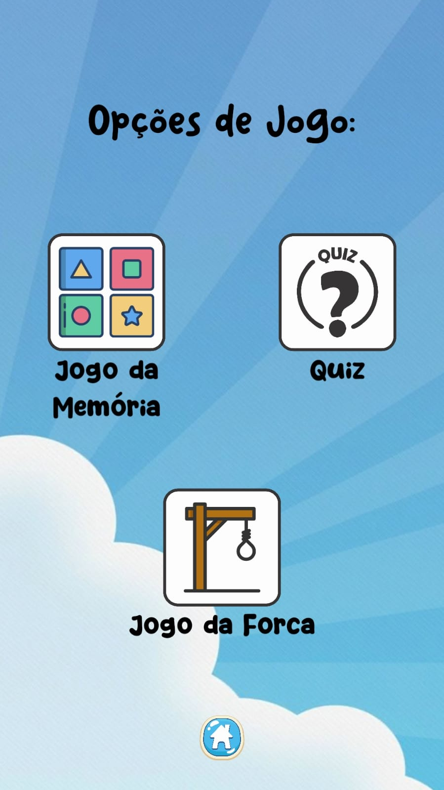
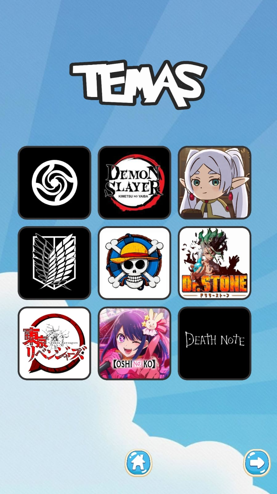
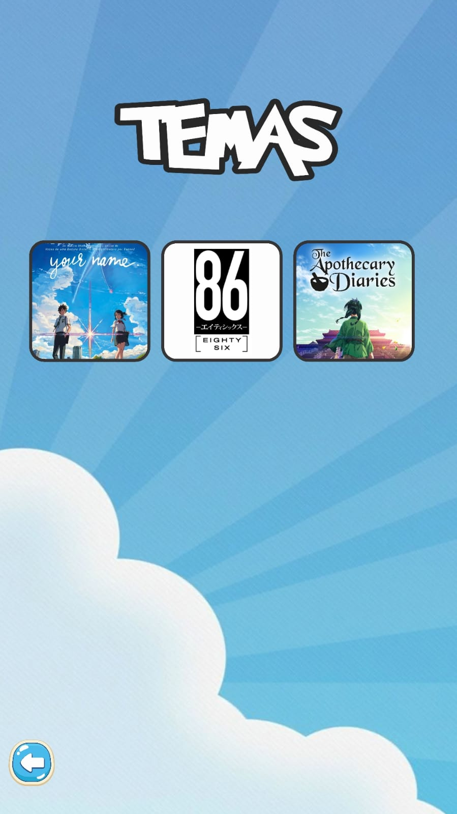
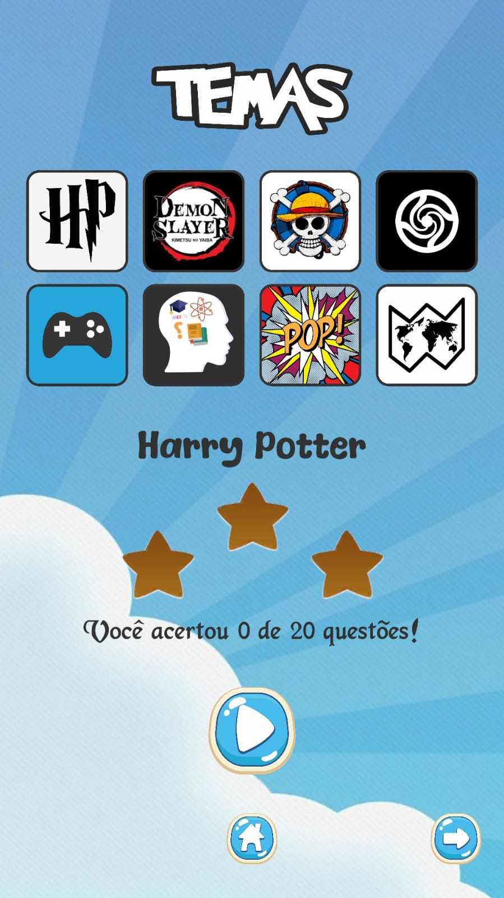
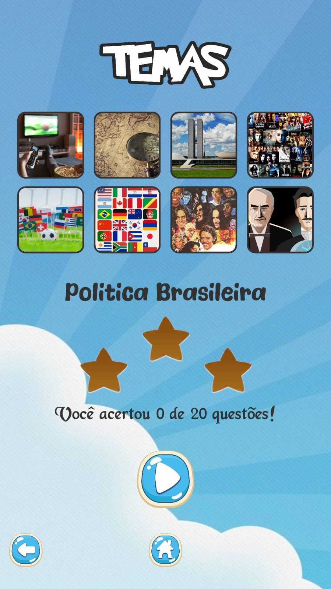
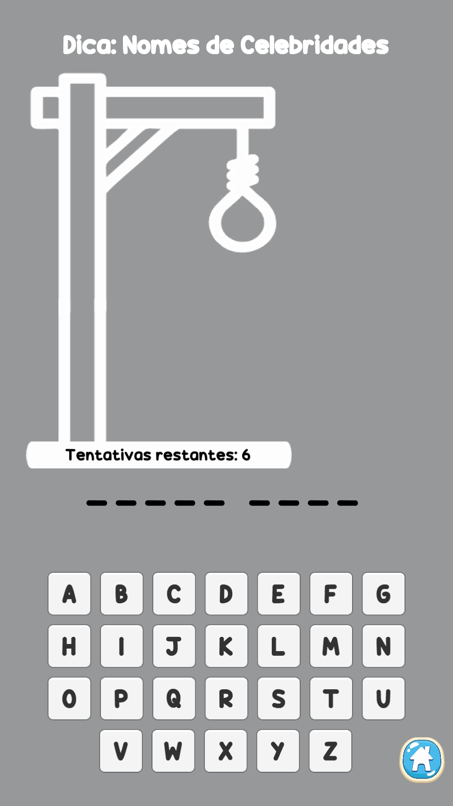
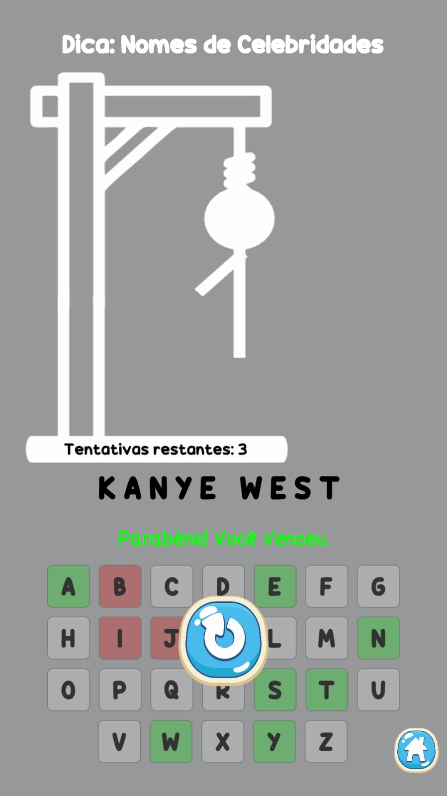

<h1> Bty Games </h1>

<h3>Informações do Jogo:</h3>
<h6>O jogo é múltiplo, incluindo três modalidades: Jogo da Memória, Jogo Quiz e Jogo da Forca, todos em uma única plataforma. Cada jogo possui temas diversos, abordando desde animação até política e futebol. Este jogo foi desenvolvido utilizando a plataforma Unity e a linguagem de programação C#.   Até a presente atualização, este jogo não possui microtransações nem exibe propagandas de qualquer forma.</h6>

<h3>Galeria de Imagens</h3>

  
  
  
  
  
  
  

<h6>Imagens de dentro do jogo.</h6>

<h3>Atual versão do jogo: <a href="https://github.com/ItalloK/Bty-Games/tree/main/1.0.0" target="_blank">1.0.0</a></h3>
<h6>Neste link tambem contem as notas de atualização da versão.</h6>

